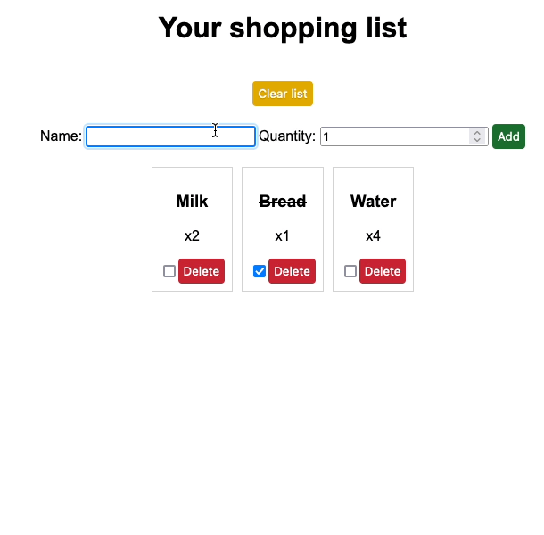
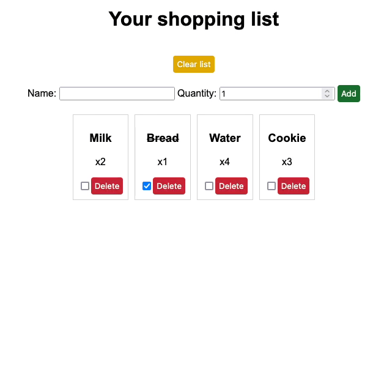
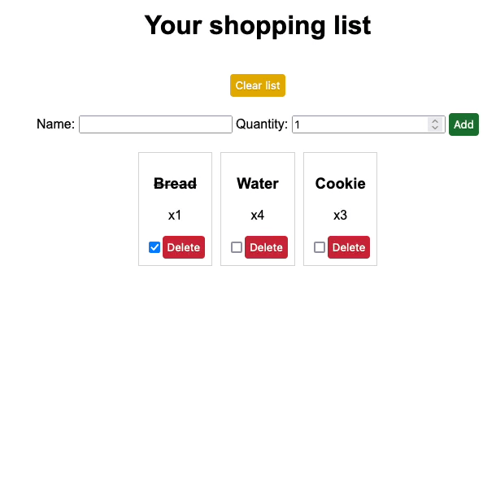

# Shopping List

> **_NOTE:_**  Frontend is not connected to Jetty and has to be started separately.

# Table of Contents

1. [Demo](#demo)
2. [Setup](#setup)

# Demo

## Adding product

## Deleting product

## Deleting all products

## Toggling if product is bought

# Setup

1. Set port where server starts in VM options: `-Dport=PORT`.
2. Create Flyway configuration file. See [flyway-example.conf](flyway-example.conf).
3. Set Flyway configuration file in VM options: `-Dflyway.configFiles=FLYWAY_CONFIG_FILE`.
4. Set Hibernate connection settings in VM options:
    - `-Dhibernate_url=URL`
    - `-Dhibernate_username=USERNAME`
    - `-Dhibernate_password=PASSWORD`
